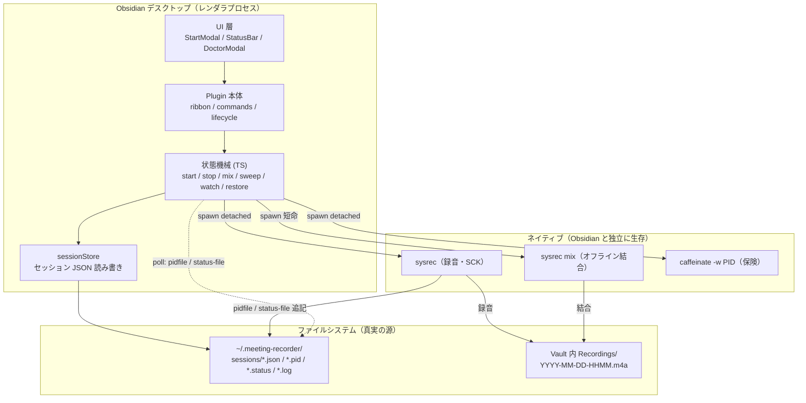
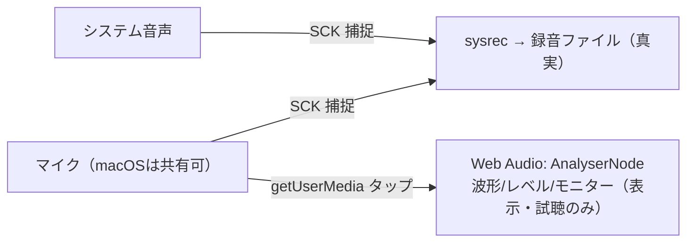
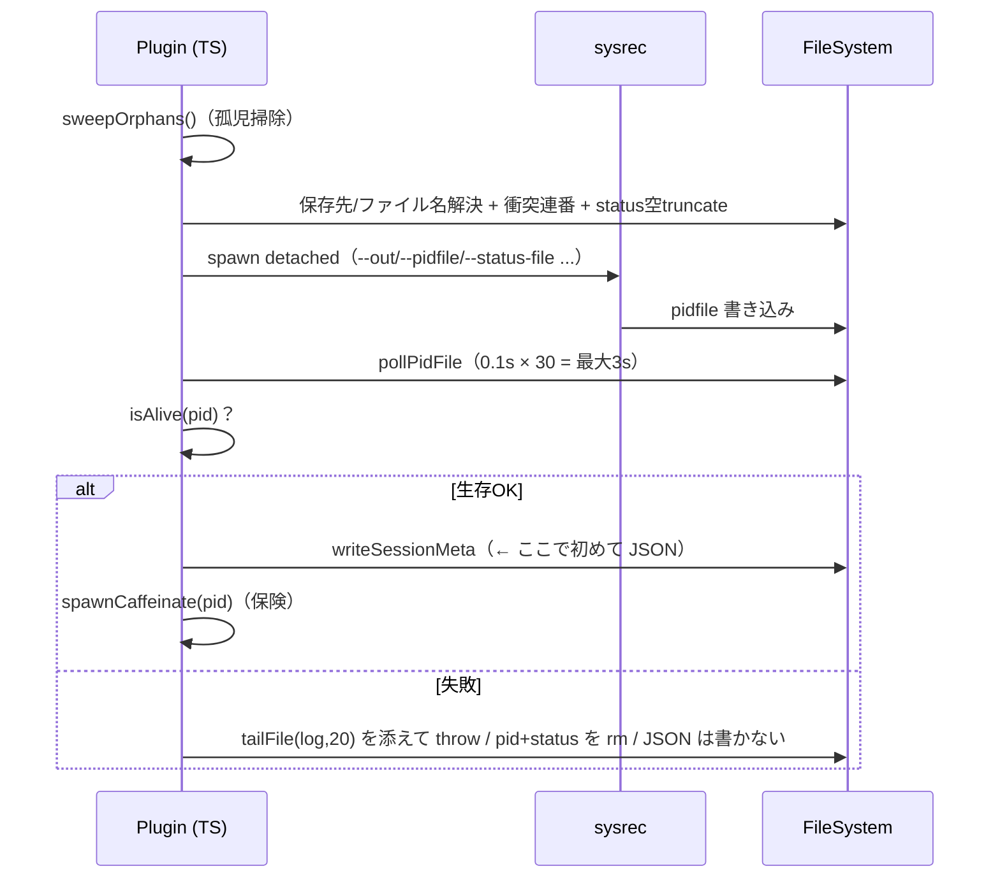
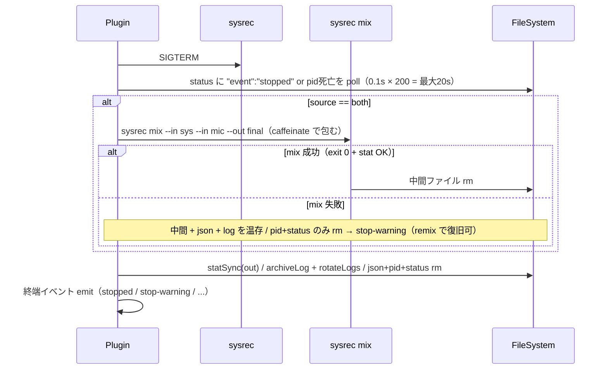
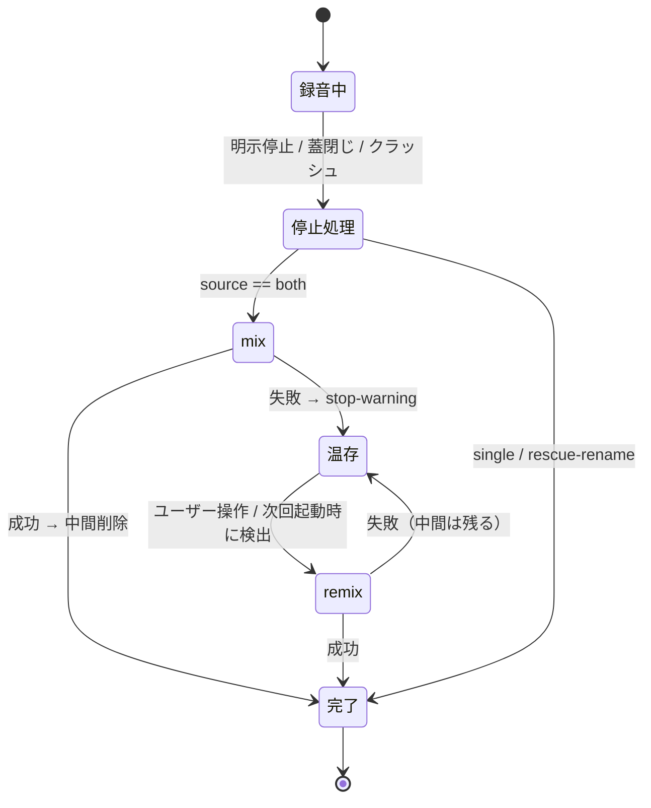
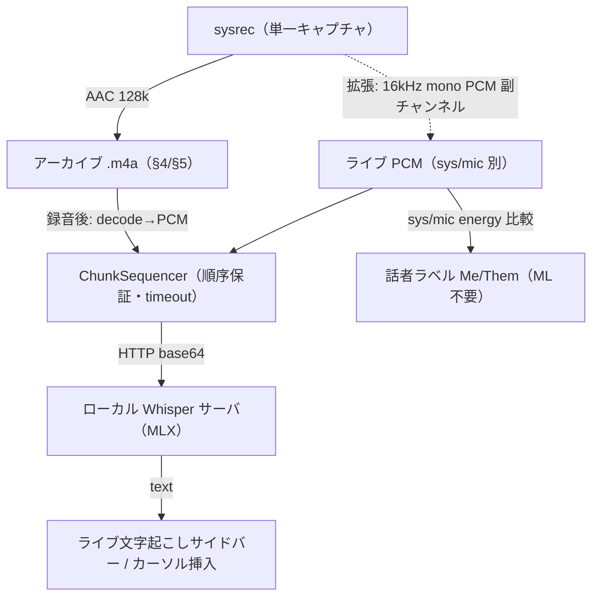

# リモート会議録音プラグイン 設計書

> [!abstract] このドキュメントについて
> Obsidian デスクトップ向け「リモート会議録音プラグイン」（plugin id: `remote-meeting-recorder`）の設計仕様書。
> 設計判断・アーキテクチャ・モジュール構成・堅牢性方針・検証戦略を定義する。実装知見の出典は [[Obsidian録音プラグイン向け 録音ノウハウレポート]]（candypi 会議録音MCP の運用実績）。

---

## 1. 目的とスコープ

### 1.1 目的

リモート会議で **相手の声（システム音声）と自分の声（マイク）を同時に録音**し、**録音データを絶対に失わない**堅牢さを持ち、成果物を **Obsidian ノートに直結**させる録音プラグインを提供する。

### 1.2 中心ユースケース

```
会議開始 → 開始モーダルでソース/保存先/同意を確認 → 録音（both = システム+マイク）
        → 会議終了 → 停止 → 2ファイルをオフライン mix → Vault 内に .m4a 保存
        → ![[YYYY-MM-DD-HHMM.m4a]] をノートに埋め込み（将来: 文字起こし連携）
```

### 1.3 スコープ

> [!info] v1（Phase 0–3）で作るもの
> - scaffold + セットアップ診断（doctor）
> - **専用録音ビュー**（タイトル / ライブ波形・レベルメーター / トランスポート / 設定パネル。添付リファレンスUIに準拠・§9）
> - 単一ソース（system / mic）録音・停止
> - both 録音 + オフライン mix + mix 失敗からの remix 復旧
> - プラグイン reload / Obsidian 再起動をまたぐセッション復元（reload 耐性）
> - 録音ビューの v1 コントロール: Source / Save to / Input（マイクデバイス）/ Monitor / Format(M4A) / Auto gain control / ライブ波形（マイク）
>
> deferred（sysrec 拡張後に順次・§4.6）: 品質(bitrate) / 手動 Gain / Noise suppression / Voice isolation / 一時停止(pause) / system のライブメーター

> [!warning] v1 スコープ外（後続 Phase / 別途）
> - Windows 対応（WASAPI + ffmpeg 経路。ノウハウは [[Obsidian録音プラグイン向け 録音ノウハウレポート#8 Windows 対応ノウハウ（将来対応するなら）|レポート §8]] にあるが本設計は macOS 専用）
> - 文字起こし（Whisper 等）実装 —— **フック点だけ**用意
> - コミュニティストア配布・Release 自動 DL —— 導線のみ

### 1.4 前提環境

| 項目 | 値 |
|---|---|
| OS | macOS 15+（`captureMicrophone` が macOS 15 以降のため）。開発機は macOS 26.5 arm64 |
| ランタイム | Obsidian デスクトップ（Electron レンダラ / `isDesktopOnly: true`） |
| ビルド | Node v24 / esbuild / TypeScript、録音バイナリは swiftc |

---

## 2. 設計判断: なぜ外部ヘルパーバイナリ方式か

> [!important] 根本判断
> **Electron/Chromium（= Obsidian）だけでは macOS のシステム音声を確実に録れない。** よって「相手の声」を録るにはネイティブヘルパーが必須になる。

| 音源 | 取得手段 | 判断 |
|---|---|---|
| マイクのみ | `getUserMedia` + `MediaRecorder` で Obsidian 内完結 | 可能だが会議録音の主目的を満たさない |
| システム音声 | `getDisplayMedia` のシステム音声キャプチャ | Obsidian の Electron バージョン依存で**アテにできない** |
| システム音声 | **ScreenCaptureKit を使う外部ヘルパー `sysrec`** | **確実。これを採用** |

> [!example] 実証: 純 Electron 経路は macOS でシステム音声が取れない
> 類似の配布プラグイン `codyklr/obsidian-sysaudio-recorder-plugin`（純 Electron/Web Audio・バイナリなし）は README で **"Windows recommended for system audio (macOS may require additional setup / has not been tested)"** と明言し、コードも system audio track が空なら "Ensure you are on Windows" と警告する。→ 本設計がヘルパーバイナリを採る根拠そのもの（詳細は §14）。

候補の `sysrec` は candypi で macOS 実機検証済み。**688 行の単一 Swift ファイル・システムフレームワークのみ依存（AVFoundation / ScreenCaptureKit / CoreMedia / CoreAudio）・ffmpeg 非依存・`swiftc` 一発ビルド**という素性のため、そのまま流用する。

### 2.1 MCP 版からの引き算

candypi は MCP コネクタで「リモートがシェル文字列（レシピ）を返し手元 Bash が実行する」間接層を持っていた。Obsidian は**ローカル実行**なので、この層は不要:

> [!note] 捨てるもの / 残すもの
> **捨てる:** レシピ方式（シェル文字列生成）・`${VAR:-}` エスケープ・PowerShell コマンドガード対策・環境変数によるバイナリパス解決。
> **残す:** 録音バイナリ `sysrec` の契約 / DSP 定数 / セッション状態機械 / スリープ対策 / UX 原則。
>
> 状態機械は **TypeScript + `child_process` / `fs`** で `spawn(bin, argv)` を直接呼ぶ形に再実装する。

---

## 3. アーキテクチャ

### 3.1 コンポーネント全体像



### 3.2 重要原則: 真実の源はファイルシステム

> [!danger] レンダラは録音より短命
> `sysrec` は **Obsidian のレンダラプロセスより長生きする**（プラグイン reload・Obsidian 再起動をまたいで録音が続く）。
> したがって **セッション状態はメモリに持たず、必ずファイル（`~/.meeting-recorder/`）に置く**。プラグインは起動時にファイルから `Map<id, SessionWatcher>` を再構築するだけ。

### 3.3 3系統のハンドシェイク

| フェーズ | 監視対象 | 理由 |
|---|---|---|
| 起動確認 | **pidfile**（バイナリ自身が書く） | 起動側の推測 PID より確実。生存を検証してから JSON を書く |
| 停止確認 | **status-file** の `"event":"stopped"` | reload をまたいでも読める（stdout は握り続けられない） |
| mix 確認 | **自分で spawn した短命 `sysrec mix` の終了コード + `fs.stat(out)`** | `mixed` イベントは status-file に書かれない癖を回避（§4.3） |

### 3.4 リッチライブUIとキャプチャの分離（添付リファレンスUI対応の要）

> [!important] 録音の真実は sysrec、ライブUIは Web Audio の「表示専用タップ」
> 添付リファレンスUI（波形 / モニター / ノイズ抑制 / 音声分離 / 入力選択）は、いずれも **マイク＝Web Audio が得意**な機能。だが本プラグインの核＝相手の声（システム音声）は sysrec 経由で、これらは録音物に効かない。
> そこで **録音ファイルは常に sysrec が生成**（system/both が確実・§6 の堅牢性を維持）し、**波形・レベルメーター・モニターはマイクを `getUserMedia` + `AnalyserNode` で別タップして表示/試聴だけ**に使う（録音物には一切影響しない）。



- ライブ波形＝**マイク入力メーター**。source が mic/both のとき表示（sysrec のマイク捕捉とは別に concurrent でマイクを読む）。**system 単体のときはマイクを録っていないので波形は出さず**、経過時間＋「システム音声を録音中」表示にする（system の真のメーターは sysrec の RMS 出力拡張後・§4.6）。
- ファイルに効かせたい DSP（品質 / 手動ゲイン / ノイズ抑制 / 音声分離）は Web Audio 制約では録音物に乗らない → **sysrec.swift 拡張で対応**（§4.6）。「効くものから段階的」方針（決定事項）に従い、**未実装トグルは UI に出さない**。

---

## 4. 録音エンジン `sysrec` の契約

> [!note] この契約は無改変で流用する
> `native/sysrec/{sysrec.swift, build.sh, sysrec.entitlements}` を candypi からコピーする。プラグインは spawn 相手としてこの契約だけ守ればよい。

### 4.1 CLI

```
録音:   sysrec --out <path> [--source both|system|mic] [--mic-device <uid>]
               [--samplerate 48000] [--channels 2] [--agc on|off]
               [--status-file <path>] [--pidfile <path>]
ミックス: sysrec mix --in <sys> --in <mic> --out <final>
               [--agc on|off] [--normalize on|off]     # ffmpeg 非依存
停止:   SIGINT / SIGTERM / 標準入力に "stop\n"
```

- `--source both` は中間 2 ファイル `<base>.sys.m4a` + `<base>.mic.m4a` を書き、`--out` はその **base**。
- pidfile は **バイナリ自身が書く**。

### 4.2 終了コード

| コード | 意味 | UI 対応 |
|---|---|---|
| 0 | 正常 | — |
| 2 | 画面収録権限なし（TCC） | 「システム設定 > プライバシー > 画面収録で Obsidian を許可」案内 |
| 3 | デバイスなし | ディスプレイ/デバイス確認 |
| 4 | ディスク等 | 保存先の空き容量確認 |
| 1 | その他 | ログ tail を提示 |

### 4.3 イベント（NDJSON）

イベントは **stdout と status-file の両方**に 1 行 JSON で追記される。ただし例外あり:

| イベント | 形状 | 出力先 |
|---|---|---|
| `started` | `{event,source,ts,pid}` | stdout + status-file |
| `stopped`（both） | `{event,source:"both",parts:{system,mic},durationSec}` | stdout + status-file |
| `stopped`（single） | `{event,source,path,durationSec,bytes}` | stdout + status-file |
| `mixed` | `{event,path,bytes,durationSec,agc,normalized,normGainDb}` | **stdout のみ** |

> [!bug] `mixed` は status-file に書かれない
> mix は別プロセスであり、`mixed` イベントは stdout のみに出る。**プラグインは mix 成否を終了コード + `fs.stat(out)` で判定**し、`mixed` をパースしない。これで癖を完全に回避する。

### 4.4 権限（TCC）とスリープ

> [!warning] 権限は spawn 元アプリに付く
> 画面収録権限は **spawn 元 = Obsidian.app** に付与される。初回録音時に Obsidian への許可ダイアログが出る旨を UI で案内する。`--source mic` でも内部で SCStream を開くため画面収録権限が要る。

- スリープ抑止は二重化: バイナリ内 `ProcessInfo.beginActivity(.idleSystemSleepDisabled)` ＋ 外側 `caffeinate -i -m -w <PID>`（PID 終了で自動終了・消し忘れゼロ）。
- **MacBook の蓋閉じスリープはどの方式でも防げない** → UI に明記して注意喚起する。

### 4.5 レベル処理（AGC / 正規化 / リミッター）

DSP はバイナリ内蔵。プラグインは `--agc on|off` を渡すだけ。既定 on で **gated RMS -16 dBFS / ピーク -1 dBFS**（テストトーンで数値検証済み・[[Obsidian録音プラグイン向け 録音ノウハウレポート#4 レベル処理 DSP レシピ（実測検証済みの全定数）|レポート §4]]）。`agc:false` で原音素通し。

### 4.6 sysrec 拡張ロードマップ（添付UI機能のうちバイナリ側が要るもの）

> [!note] 「効くものから段階的」方針（決定事項）
> 下表の拡張が入るまで、該当 UI トグルは**出さない**（見た目だけの未対応トグルは置かない）。Input 選択は小さく有用なので早期に入れる。既存の `sysrec.swift` は無改変流用が原則だが、以下は本プラグインのための追加改修。

| 機能 | 必要な sysrec 拡張 | 規模 / リスク | 時期 |
|---|---|---|---|
| Input デバイス選択 | `sysrec list-devices`（UID 一覧を JSON 出力）→ dropdown 生成し `--mic-device` に渡す | 小・低 | 早期（v1） |
| Quality（bitrate） | `--bitrate <kbps>`（録音 / mix の AAC 設定を可変化） | 小・低 | 順次 |
| Gain（手動） | `--gain <dB>`（AGC off 時の固定ゲイン） | 小・低 | 順次 |
| Noise suppression | macOS マイクモード（`AVCaptureDevice` preferred mic mode）or DSP 追加 | 中・要検証 | 順次 |
| Voice isolation | macOS 音声分離マイクモード（SCK マイク捕捉が尊重するか要プローブ） | 中・要検証 | 順次 |
| 一時停止（pause） | AVAssetWriter 一時停止（タイムスタンプ整合） | 中 | 後続（v1 範囲外） |
| マイクミュート（録音中） | sysrec の stdin 制御に `mute`/`unmute` 追加（録音物のマイクを一時的に無音化）。**本設計の Web Audio タップは表示専用なのでミュートは sysrec に届かせる必要**（§14.3） | 小〜中 | 順次 |
| system ライブメーター | 録音中に定期 RMS/peak を status へ emit → §3.4 の system 表示に反映 | 小〜中 | 順次 |
| ライブ PCM 副チャンネル（文字起こし用） | 録音中に 16kHz mono PCM を第2 FD/FIFO へ emit（アーカイブ m4a と併行）。**リアルタイム文字起こしの入口**（§15.1） | 中 | 後続（文字起こし②・§15.2） |

---

## 5. セッション状態機械

candypi `recipes.ts` / `tools.ts` の **アルゴリズムだけ**を TypeScript に 1:1 移植する。

### 5.1 状態ディレクトリ

```
~/.meeting-recorder/            # 設定で上書き可
  sessions/
    <id>.json                   # セッションメタ（真実の源）
    <id>.pid                    # バイナリが書く
    <id>.status                 # バイナリがイベント追記
    <id>.log                    # stderr
  logs/
    <id>.log                    # 停止時に退避（30日ローテ）
```

**セッション JSON:** `{id, pid, platform:"darwin", source, agc:"on"|"off", out, bin, startedAt, label}`
**SID:** `rec_` + `Date.now().toString(36)` + `Math.random().toString(36).slice(2,6)`

### 5.2 開始フロー

> [!important] 起動検証してから JSON を書く
> pid=0 や即死セッションの「壊れた JSON」を残さないため、**生存確認が通ったときだけ**セッション JSON を書く。



### 5.3 停止フロー



### 5.4 終端イベント（UI が解釈すべき語彙）

| イベント | 意味 | UI の反応 |
|---|---|---|
| `stopped` | 成功。最終 `.m4a` が `path` に | Notice + 埋め込み挿入 |
| `stop-warning` | mix 失敗。中間+セッション温存 | 「⚠ remix needed」を残し remix へ導線 |
| `remixed` | remix 成功 | Notice + 埋め込み |
| `remix-error` | remix 失敗。中間は温存 | 再試行案内 |
| `start-error` | 起動失敗 | ログ tail を提示 |

---

## 6. 堅牢性方針（録音データを絶対に失わない）

> [!success] 実運用で効いた設計ルール（レポート §5）
> これらは保険ではなく**必須機能**。candypi では mix 失敗 → remix 復旧を実際に使った。

1. **起動検証してから JSON を書く**（§5.2）—— 壊れた状態を残さない。
2. **孤児 sweep で中間ファイルがあるセッションは温存** —— PID 死亡でも `<base>.sys.m4a` / `.mic.m4a` が残っていれば remix 待ちとして**消さない**（消すと録音喪失）。
3. **mix 失敗時は中間ファイルを絶対消さない** —— `stop-warning` で温存し remix 経路で復旧。
4. **片方だけ録れていたら rename で救う** —— both 指定で sys だけ/mic だけ存在なら mix せず `mv` で最終ファイル化。
5. **ファイル名衝突は自動連番** —— `name.m4a` → `name-2.m4a` → `name-3.m4a`（2 始まり・上書き事故防止）。
6. **ログは消さず退避** —— 停止成功時も `logs/` へ mv、30 日ローテ。原因究明のため。
7. **`onunload` で録音を殺さない** —— watcher の interval を止めるだけ。`sysrec` と `caffeinate` は生存継続。

### 6.1 データを消す経路を持たない



---

## 7. reload 耐性とライフサイクル

> [!important] 外部停止もすべて同じ `finalizeSession` に集約する
> 明示停止・蓋閉じ・クラッシュ ―― どの経路でも `SessionWatcher` の liveness poll が pid 死亡を検知し、**同じ finalize（both は自動 mix、失敗は stop-warning 温存）**へ流す。分岐を一本化する。

- **起動時（`onload`）:** `sweepOrphans` → `restoreInProgressSessions`。生存 pid は `SessionWatcher` + status bar を復元、死亡かつ中間ファイルありは「異常終了 — Remix 実行を」Notice。
- **監視方式:** `fs.watch` ではなく **1 秒 poll**（sleep/wake をまたぐ append に `fs.watch` は不安定。elapsed 時計にも必要）。3 tick 毎に isAlive + status tail。

---

## 8. モジュール構成

```
remote-meeting-recorder/
  manifest.json / package.json / tsconfig.json / esbuild.config.mjs / styles.css
  main.ts                       # 薄いエントリ
  src/
    main.ts                     # Plugin 本体: ribbon / commands / status bar / onload=restore / onunload=非kill
    settings.ts                 # RMRSettings / DEFAULT_SETTINGS / RMRSettingTab
    context.ts                  # RecorderContext（app / settings / paths / resolveBinPath / finalizeSession 参照）
    types.ts                    # SessionMeta / TerminalEvent / RecorderSource / StartOptions
    state/
      paths.ts                  # stateDir / sessionsDir / logsDir / sessionPaths
      sessionStore.ts           # newSessionId / read(atomic)write / list / delete / archiveLog / rotateLogs
    recorder/
      spawn.ts                  # isAlive / pollPidFile / spawnDetached / spawnCaffeinate
      start.ts                  # startRecording()
      stop.ts                   # stopRecording() / finalizeSession()（in-flight ロックで冪等化）
      mix.ts                    # runMix() / rescueRename() / remix()
      sweep.ts                  # sweepOrphans()
      watch.ts                  # SessionWatcher（1s tick: elapsed + liveness + terminal 検出）
      restore.ts                # restoreInProgressSessions()
    doctor/diagnostics.ts       # runDoctor(): DoctorCheck[]
    audio/
      webAudioTap.ts            # getUserMedia + AnalyserNode（ライブメーター）/ monitor ルーティング（表示・試聴専用・録音物に非影響）
      waveform.ts               # canvas による波形/レベル描画
    ui/
      RecordingView.ts          # ItemView（タイトル/波形/トランスポート/設定パネル）— 主要UI（旧 StartModal を統合）
      controlWindow.ts          # Electron BrowserWindow の常時前面ミニ制御（波形/停止・任意・Phase 4）→ controlWindowHtml.ts の埋め込み HTML を一時ファイルへ書き出して loadFile + IPC
      controlWindowHtml.ts      # ↑の HTML をバンドル埋め込み（BRAT/自己配布で同梱漏れしないよう外部ファイル非依存）
      MeetingSidebar.ts         # ライブ文字起こし ItemView（timer/pause/mark-moment/stop・文字起こし②・§15.3）
      DoctorModal.ts / statusBar.ts / embed.ts
    platform/
      hotkeys.ts                # Electron globalShortcut（Obsidian 非フォーカスでも start/stop/mute・Phase 4）
    transcribe/                 # 文字起こしサブシステム（設計のみ・実装は録音コア後・§15）
      chunkSequencer.ts / whisperClient.ts / pcm.ts / diarize.ts
    meeting/
      detector.ts               # 会議アプリ自動検出（ps ＋通話専用プロセス・§15.3）
    ai/
      summarize.ts              # ローカルサーバ経由の要約 / action items 抽出（既定 Anthropic=Claude）
    util/
      fsx.ts                    # atomicWriteFile / tailFile / ensureDir / exists
      time.ts                   # defaultFilename() / formatElapsed()
      resolveBin.ts
  native/sysrec/                # candypi からコピー（無改変）
  test/
    fake-sysrec.sh              # 契約再現スタブ
    e2e.mjs                     # start/stop/mix-fail/remix/sweep を実バイナリなしで駆動
```

### 8.1 主要シグネチャ（抜粋）

```ts
// recorder/start.ts
startRecording(ctx, o: StartOptions): Promise<{ sessionId; out; pid }>
// recorder/stop.ts
stopRecording(ctx, id): Promise<TerminalEvent>
finalizeSession(ctx, meta): Promise<TerminalEvent>   // in-flight Set<id> で冪等化
// recorder/mix.ts
runMix(ctx, bin, sys, mic, out, agc): Promise<boolean>     // 終了コードで成否
rescueRename(sys, mic, out): boolean
remix(ctx, { sessionId?, outPath?, agc? }): Promise<TerminalEvent>   // agc 優先: arg→json→"on"
// recorder/sweep.ts
sweepOrphans(ctx): void
// recorder/watch.ts
class SessionWatcher { constructor(ctx, meta, onTick, onTerminal); start(); stop(); }
// recorder/restore.ts
restoreInProgressSessions(ctx): Promise<SessionMeta[]>
// util/resolveBin.ts — 優先: settings.binPath → native/sysrec/sysrec → bin/sysrec → PATH "sysrec"
resolveBinPath(ctx): string
```

---

## 9. UI 設計

添付リファレンスに倣い、**専用の録音ビュー（`RecordingView`: `ItemView`）を主要 UI** とする（当初案の開始モーダルはこのビューに統合）。メインペインに開き、上から「タイトル → ライブ波形 → トランスポート → 設定パネル」を積む。

### 9.1 録音ビュー（RecordingView）

```
┌─────────────────────────────────────────────┐
│  2026-07-03 Recording          （タイトル編集可）│
├─────────────────────────────────────────────┤
│  ▁▃▅▂▆▃▁▅▂ …    ライブ波形/レベルメーター（canvas）│
│                  mic/both=マイクメーター、        │
│                  system=経過時間＋「録音中」表示   │
├─────────────────────────────────────────────┤
│      [ ● 録音 ]    [ ‖ ]※v1不可    [ □ 停止 ]      │
├─────────────────────────────────────────────┤
│  Source     ( ) mic   ( ) system   (•) both      │
│  Save to    Recordings/               （Vault内）│
│  Input      Default – MacBook Pro のマイク    ▾  │
│  Monitor    [ off ]  入力を再生（ヘッドホン推奨） │
│  Format     M4A（固定）                           │
│  Auto gain  [ on ]                               │
│  ☐ 参加者に録音の告知・同意を得た（録音ボタンを gate）│
│  ⚠ MacBook の蓋を閉じると録音は止まります         │
└─────────────────────────────────────────────┘
```

**コントロール対応表（v1）:**

| コントロール | 実装 | v1 |
|---|---|---|
| タイトル編集 | ファイル名 stem に反映（既定 `YYYY-MM-DD-HHMM`） | ✅ |
| ライブ波形 / メーター | Web Audio `AnalyserNode`（マイク・表示専用・§3.4） | ✅（mic/both）|
| 録音 / 停止 | `startRecording` / `stopRecording`（sysrec） | ✅ |
| 一時停止（pause） | sysrec 拡張が必要（§4.6） | ✖ 非表示/disabled |
| Source（mic/system/both） | `StartOptions.source` → `--source` | ✅（毎回確認）|
| Save to（保存先） | Vault 内 `Recordings/` 既定・`normalizePath` | ✅（毎回確認）|
| Input（デバイス） | `sysrec list-devices` → `--mic-device`（§4.6） | ✅（早期）|
| Monitor | Web Audio（マイク→出力・既定 off） | ✅ |
| Format | M4A 固定（sysrec は AAC/.m4a） | ✅ |
| Auto gain control | `--agc on/off`（既定 on） | ✅ |
| Quality / Gain / Noise suppression / Voice isolation | sysrec 拡張後に追加（§4.6） | ✖ 未表示 |

### 9.2 UX 契約の担保（毎回確認・同意）

> [!important] 毎回確認・無確認スキップ不可（レポート §7）
> **Source と Save to はビュー上に常時表示**し、録音の都度ユーザーが確認・変更できる（前回値をプリセット、暗黙フォールバック無し）。**同意チェックが録音ボタンを gate** する。これで「意図しない場所に保存」「マイクのつもりが both」を防ぐ。録音中は設定を lock（変更はセッション単位で一貫・レポート §7）。

### 9.3 設定（RMRSettingTab）

既定値: `{ binPath:"", defaultSaveDir:"Recordings", saveInVault:true, stateDir:"", sampleRate:48000, channels:2, defaultAgc:true, defaultSource:"both", monitor:false, inputDeviceUid:"", insertEmbedOnStop:true }`

グローバル既定（バイナリパス〔Detect + doctor 状態表示〕/ 保存先 + Vault 内トグル / stateDir / sampleRate / channels / AGC / ソース / 入力デバイス / モニター / 埋め込み挿入）と「診断を実行」ボタン。**録音ごとの値はビューが持ち**、ここは初期プリセットを与えるだけ。

### 9.4 その他 UI

- **ribbon**（`circle-dot`）→ 録音ビューを開く（無ければ生成）
- **コマンド:** Open recording view / Start / Stop（複数時 quick-pick）/ Remix last failed recording / Run diagnostics (doctor)
- **グローバルホットキー**（Phase 4・§14.3）: Electron `globalShortcut` で **Obsidian 非フォーカスでも** start/stop（将来 mute）。会議アプリを前面にしたまま操作できる。
- **常時前面ミニ制御ウィンドウ**（Phase 4・任意・§14.3）: frameless/transparent/alwaysOnTop の `BrowserWindow`。波形＋停止（＋将来 mute）を会議アプリの前面に浮かせる。Obsidian のアクセントカラーに追従。録音ビュー（§9.1）の常駐版という位置づけ。
- **StatusBar:** `● REC 12:34`（クリックでビューへ）。`stop-warning` 時は「⚠ remix needed」を残す
- **DoctorModal:** `[OK]/[NG]/[WARN]` + 直し方。安全なものはアクションボタン（quarantine 除去 / sysrec ビルド / mic・画面収録権限案内）
- **embed:** **録音開始時のアクティブノートを埋め込み先に固定**（長時間録音中にノートが切り替わっても開始時のノートへ挿入・§14.3）。`stopped` かつ Vault 内なら `normalizePath` で相対パス化し `![[<相対>.m4a]]` を挿入。Vault 外は絶対パスを Notice

---

## 10. ビルドと配布

npm scripts:

| script | 内容 |
|---|---|
| `dev` | `node esbuild.config.mjs`（watch） |
| `build` | `tsc -noEmit -skipLibCheck && node esbuild.config.mjs production` |
| `build-sysrec` | `sh native/sysrec/build.sh native/sysrec/sysrec` |
| `test:e2e` | `node test/e2e.mjs` |

- **ローカル開発:** `build-sysrec` → `resolveBinPath` が `native/sysrec/sysrec` を自動検出。テスト vault へ `ln -s <repo> <vault>/.obsidian/plugins/remote-meeting-recorder`。
- **将来の配布（Phase 5）:** 未検出時に「ビルド（推奨・swiftc あり）」か「Release から DL → `chmod +x` / `xattr -d com.apple.quarantine` / ad-hoc `codesign`」を doctor に組込む。既存ビルド済みバイナリは arm64/minos 26.0 のため配布時は**要リビルド**（universal + 低 deployment target）。

---

## 11. 検証戦略

> [!example] A. ニセバイナリ E2E（主・実録音なし・CI 可）
> `test/fake-sysrec.sh`（~30行 sh）が契約を再現: `--out/--pidfile/--status-file/--source` 解釈、pidfile に pid、status+stdout に `started`、TERM/INT を `trap` して finalize（both は中間 2 ファイル + `parts` 付き `stopped`、single は `path/bytes`）。`mix` サブコマンドは `touch out` + `mixed` echo、`FAKE_MIX_FAIL=1` で exit 1（stop-warning/remix 試験）、`FAKE_NO_PIDFILE=1` で start-error。
> `test/e2e.mjs` が temp stateDir をスタブに向け、**start→stop（single / both mix ok / mix 失敗→温存→remix→cleanup）・sweep（中間あり/なし）**を assert。

- **B. 実機 E2E:** `build-sysrec` → テスト vault シンボリックリンク → Obsidian に画面収録権限 → system 10 秒録音 → `![[…]]` 再生 → both 録音 → mix 確認 → 録音中 reload → status bar 復元 → `pmset -g assertions` で sysrec pid のアサーション確認。
- **C. 単体:** SID 形式 / 連番 / corrupt-json 耐性 / rotateLogs mtime カットオフ / resolveBinPath 優先順位。

---

## 12. Phase 分割

| Phase | 内容 | 到達点 |
|---|---|---|
| 0 | scaffold + doctor + native コピー | plugin load / ribbon 表示 / `build-sysrec` 成功 / doctor 実チェック表示 |
| 1 | 最小縦切り（**録音ビュー** + 単一ソース） | RecordingView から system/mic を録音・停止、mic は **ライブ波形表示**、Vault 内 `.m4a` を `![[…]]` 再生確認 |
| 2 | both + 復旧 | both mix 成功 / mix 失敗を `stop-warning`→remix で復旧 |
| 3 | reload 耐性 | 録音中 reload で status bar・録音ビュー復元 / 外部 kill で自動 finalize |
| 4（後続） | 録音ビュー拡充（Input=`list-devices` / Monitor / bitrate / 手動 Gain）/ **グローバルホットキー** / **常時前面ミニ制御ウィンドウ**（§14.3）/ ログローテ / 埋め込み・デイリーノート連携 / doctor 修復ボタン / 文字起こしフック点 | — |
| 5（後続） | Noise suppression / Voice isolation（sysrec マイクモード拡張）/ 一時停止(pause) / マイクミュート（sysrec 制御拡張）/ Release 配布 / BRAT / README | — |
| 6（後続） | **文字起こし①（録音後 一括）**: m4a→16kHz PCM→ローカル Whisper サーバ（MLX）→全文＋AI要約をノート化（sysrec 無改修・§15.2） | — |
| 7（後続） | **文字起こし②（リアルタイム）**: sysrec ライブ PCM 拡張 → ChunkSequencer → ライブサイドバー / 会議自動検出 / 話者ラベル（§15） | — |

> [!note] 添付UIコントロールの実装時期
> Phase 1 の録音ビューは **Source / Save to / AGC / Format(M4A) / ライブ波形（マイク）** を備える。**Input 選択・Monitor** は Phase 4、**Noise suppression・Voice isolation・pause** は Phase 5（いずれも §4.6 の sysrec 拡張前提）。「効くものから段階的」方針に従い、未実装トグルは UI に出さない。

---

## 13. 将来拡張

- **文字起こし連携**（Obsidian の本命ユースケース）: §15 で独立サブシステムとして設計済み（ローカル Whisper サーバ MLX・録音後一括 → リアルタイム）。入口は `stopped` の `path`（一括）／ sysrec ライブ PCM 副チャンネル（リアルタイム・§15.1）。実装は Phase 6–7。
- **デイリーノート連携:** 保存時に `[[YYYY-MM-DD]]` へ自動リンク/埋め込み。
- **Windows 対応:** WASAPI ループバック + ffmpeg（[[Obsidian録音プラグイン向け 録音ノウハウレポート#8 Windows 対応ノウハウ（将来対応するなら）|レポート §8]]）。

---

## 14. 参考プラグイン調査（prior art）: `codyklr/obsidian-sysaudio-recorder-plugin`

コミュニティ配布の類似プラグイン "Audio Recorder"（v1.2.0・MIT・単一 `main.ts` ~760 行＋Electron `BrowserWindow`）。**外部バイナリなし・純 Electron/Web Audio** でシステム音声＋マイクを録る。本設計と対極の実装のため、裏付け・取り込み・差別化の観点で精査した。

### 14.1 実装方式

- **システム音声**: `electron.desktopCapturer.getSources({types:["screen"]})` → `getUserMedia({audio:{mandatory:{chromeMediaSource:"desktop", chromeMediaSourceId}}})`（Chromium デスクトップキャプチャ）。
- **マイク**: `getUserMedia({audio:{deviceId}})`。
- **ミックス**: Web Audio でリアルタイム合成（`AudioContext` + `MediaStreamDestination` + master `GainNode`）→ 単一 `MediaStream`。
- **録音**: `MediaRecorder`（`audio/webm`）。WAV 選択時は停止後に `decodeAudioData` → 手書き RIFF に変換。`fix-webm-duration` で WebM の再生時間メタを補正。
- **保存**: `vault.createBinary` → **録音開始時点のアクティブノート**へ `![[path]]` を追記。
- **常時前面ミニ制御**: frameless/transparent/alwaysOnTop の `BrowserWindow`（HTML は `controlWindowHtml.ts` に埋め込み、起動時に一時ファイルへ書き出して `loadFile`）。20 本バーの波形（`AnalyserNode` → IPC `audio-level`）、マイクミュート、停止。Obsidian のアクセントカラーに追従。
- **グローバルホットキー**: Electron `globalShortcut`（既定 `CommandOrControl+Shift+M` でミュート・**Obsidian 非フォーカスでも効く**）。

### 14.2 本設計の裏付け（最重要）

> [!success] 「macOS はヘルパー必須」を実証
> README に **"Windows recommended for system audio (macOS may require additional setup / has not been tested)"**、コードも system audio track が空なら "Ensure you are on Windows" と警告。**純 Electron 経路はシステム音声が Windows では取れても macOS では実質不可** —— 本設計が sysrec を採用した根拠そのもの（§2）。

### 14.3 取り込む知見

| 知見 | 反映先 |
|---|---|
| 常時前面ミニ制御ウィンドウ（会議アプリ前面で操作） | §8 `ui/controlWindow.ts` / §9.4 / Phase 4 |
| グローバルホットキー（非フォーカスで start/stop/mute） | §8 `platform/hotkeys.ts` / §9.4 / Phase 4 |
| 録音開始時のアクティブノートを埋め込み先に固定 | §9.4 embed / `embed.ts` |
| 波形描画レシピ（level を `pow(0.5)` ＋微ノイズ → バー高/透明度） | §8 `waveform.ts` |
| アクセントカラー追従（`--interactive-accent`） | `controlWindow.ts` |

### 14.4 本設計が優位な点（維持する）

| 論点 | 参考プラグイン | 本設計 |
|---|---|---|
| クラッシュ/reload 耐性 | 録音状態＋音声チャンクを**レンダラのメモリ**に保持 → reload/crash で**全損**。`onunload` で録音停止 | sysrec＋セッションファイル。reload 継続・孤児 sweep・remix 復旧（§5–§7） |
| レベル処理 | 素のミックス（正規化なし） | sysrec DSP（-16 dBFS 正規化＋-1 dBFS リミッター・§4.5） |
| ミックス方式 | リアルタイム単一ストリーム | 別録り 2 トラック → オフライン mix（片系失敗に強い・トラック別レベル・§4/§6） |
| 出力 | WebM（要 `fix-webm-duration`）/ WAV（全体 decode → 大容量でメモリ懸念） | m4a ストリーミング（Obsidian ネイティブ埋め込み） |
| macOS システム音声 | 実質不可 | sysrec で確実 |

### 14.5 採らない実装

- `onunload` で録音停止（本設計は録音を殺さない・§6/§7）
- メモリ内チャンク保持（復旧不可）
- レベルメーターの `ScriptProcessorNode`（非推奨）→ `requestAnimationFrame` で `AnalyserNode.getByteFrequencyData` を読む
- `BrowserWindow` の `nodeIntegration:true / contextIsolation:false`（採用時は preload + `contextBridge` を検討）

### 14.6 Windows 対応への示唆

この純 Electron 経路は**そのまま Windows 実装の候補**になる（`desktopCapturer` は Windows でシステム音声可・バイナリ不要）。将来の Windows 対応は winrec（[[Obsidian録音プラグイン向け 録音ノウハウレポート#8 Windows 対応ノウハウ（将来対応するなら）|レポート §8]]）と、この Web Audio 経路の 2 択になる。

---

## 15. 文字起こしサブシステム（設計のみ・実装は録音コア〔Phase 0–3〕後）

> [!info] 方針（決定事項）
> エンジン = **ローカル Whisper サーバ（MLX）**（音声はマシン外に出ない・Apple Silicon で高速）。実装は録音コア完成後、**① 録音後の一括文字起こし（sysrec 無改修）→ ② リアルタイム（sysrec ライブ PCM 拡張）** の順（Phase 6–7）。知見の出典は §16（voice-notes）。

### 15.1 データ経路: アーカイブと文字起こしの分離

録音の真実は sysrec の **m4a（高品質アーカイブ）**。文字起こしは **16kHz mono PCM**（Whisper ネイティブ）が要る。両者を分離する（voice-notes は 16kHz WAV 一本で兼用し音質を犠牲にしている・§16.3）:



### 15.2 二段階の実装

- **① 録音後 一括（先行・sysrec 無改修・Phase 6）:** 停止後、最終 m4a を decode → 16kHz mono PCM 化してサーバへ（`is_chunk:false`）。全文＋AI 要約をノート化。リアルタイム性なし・sysrec 改修なし。**録音コアが出来ればすぐ載る**。
- **② リアルタイム（sysrec 拡張後・Phase 7）:** sysrec が録音中に 16kHz mono PCM を副チャンネル（第2 FD / FIFO / localhost socket）へ emit → `ChunkSequencer` が一定間隔（会議 ≥7s）でサーバへ → **ライブサイドバー**へ順次表示。

### 15.3 主要コンポーネント（voice-notes から移植・§16）

- `transcribe/chunkSequencer.ts` — seq 番号で**順序フラッシュ**・per-chunk timeout（[chunk-sequencer.ts 相当]）。
- `transcribe/whisperClient.ts` — `requestUrl` で `/health` `/transcribe` `/summarize` を叩く薄い HTTP クライアント。base64 float32 PCM。
- `transcribe/pcm.ts` — `mergePCM` / `f32ToB64` / `pcmToWav`（[audio-utils.ts 相当]）。
- `transcribe/diarize.ts` — sys/mic energy 比較で Me/Them ラベル（`stereoLabel` 相当・<10ms・ML なし）。**sysrec の別録り 2 トラック（§4「both は別録り」/§5.1）をそのまま入力にできる**——本設計との強い相乗。
- `ui/MeetingSidebar.ts` — ライブ文字起こし `ItemView`（header/dot/app/timer/status/transcript ＋ pause / mark-moment / stop・[meeting-sidebar.ts 相当]）。
- `meeting/detector.ts` — `ps` ＋通話専用プロセス（Zoom `CptHost` / Teams `MSTeamsCall` 等）＋`osascript` 可視ウィンドウで会議検出 → トースト提案・30s ポーリング（[meeting-detector.ts 相当]）。
- `ai/summarize.ts` — サーバ `/summarize` 経由で要約・action items / decisions 抽出。**既定 Anthropic(Claude)**（ユーザ環境に合致）、OpenAI / Ollama も設定可。

### 15.4 追加設定（文字起こし関連）

serverUrl（既定 `http://127.0.0.1:5678`）/ whisperModel / language / chunkSeconds / translateToEnglish / diarizeEnabled / aiProvider＋key＋model / meetingPostAction（transcript | summary | full）/ autoOpenSidebar / meetingApps。

### 15.5 doctor 追加チェック

Whisper サーバ疎通（`/health`）・モデル / デバイス表示、（リアルタイム時）sysrec のライブ PCM 対応可否。

---

## 16. 参考プラグイン調査②: `iahmedani/obsidian-voice-notes`

"Voice Notes (Local Whisper)" v1.0.1（MIT・src ~2000 行）。ローカル Whisper でリアルタイム文字起こし＋会議モード＋AI 要約。**リアルタイム文字起こしの実装リファレンス**として精査した。

### 16.1 実装方式

- 音声 = **16kHz mono Float32 PCM** を AudioWorklet(`pcm-processor`)で取得。
- システム音声 3 段: **SCK ヘルパー `vn-audio-capture`**（生 PCM を stdout へ stream / "READY" を stderr / SIGINT 停止）→ **BlackHole** 仮想デバイス → **mic-only**。auto 検出＋"Test capture"。
- 文字起こし = 一定間隔で PCM を `ChunkSequencer` へ → ローカル Whisper サーバ（`/transcribe`・base64 float32）へ HTTP、**seq 番号で順序保証・per-chunk timeout**。onText → カーソル / サイドバー挿入。
- 停止 = 最終 flush → WAV 保存 → callout → 会議は AI 要約。
- サーバ = companion `voice-notes-server`（**MLX** or Docker）。`/health /transcribe /translate /summarize`。
- 話者 = mic energy vs system energy 比較（`stereoLabel`・<10ms・ML なし）or サーバ pyannote。
- 会議検出 = `ps` ＋通話専用プロセス（Zoom `CptHost` / Teams `MSTeamsCall`）＋`osascript` 可視ウィンドウ・30s ポーリング → トースト。
- AI 要約 = Anthropic / OpenAI / Ollama、action items / decisions / follow-ups 抽出。

### 16.2 本設計の裏付け

> [!success] macOS ヘルパー必須の三度目の実証
> このプラグインも system audio を **ScreenCaptureKit ヘルパーバイナリ**（`vn-audio-capture`）で取り、`getDisplayMedia` に頼っていない。§14（codyklr）と合わせ、**独立した 2 プラグインが同じ結論**に達している = 本設計の sysrec 採用は妥当（§2）。

### 16.3 本設計が優位な点

| 論点 | voice-notes | 本設計 |
|---|---|---|
| 長時間 / reload 耐性 | 全 PCM を**メモリ保持**（`MAX_PCM_SAMPLES` = 30 分 / ~115MB 上限・reload で全損） | sysrec → m4a ストリーミング＋セッションファイル。長時間・reload に強い（§5–§7） |
| アーカイブ音質 | 16kHz mono WAV（文字起こし用の低品質を録音にも兼用） | m4a（sysrec DSP -16dBFS / -1dBFS）と 16kHz PCM を**分離**（§15.1） |

### 16.4 意図的な差異

- **エンジンは同じくローカル Whisper サーバ（MLX）を採用【決定】**。ただしキャプチャは voice-notes の AudioWorklet ではなく **sysrec のライブ PCM 副チャンネル**（システム音声はレンダラで安定して取れないため・§2）。mic-only の dictation なら AudioWorklet 経路でも可。

---

## 付録: 関連ドキュメント

- [[Obsidian録音プラグイン向け 録音ノウハウレポート]] —— 実装知見の出典（candypi 会議録音MCP の運用実績）
- 参考プラグイン①: [codyklr/obsidian-sysaudio-recorder-plugin](https://github.com/codyklr/obsidian-sysaudio-recorder-plugin)（§14）
- 参考プラグイン②: [iahmedani/obsidian-voice-notes](https://github.com/iahmedani/obsidian-voice-notes)（§15/§16）・サーバ [iahmedani/voice-notes-server](https://github.com/iahmedani/voice-notes-server)
- 実装計画（承認済み）: `~/.claude/plans/obsidian-steady-hinton.md`

*作成: 2026-07-03 / status: draft*
*改訂: 2026-07-03 —— 添付リファレンスUI（専用録音ビュー・ライブ波形・設定パネル）を反映。方針決定: ①録音は sysrec 統一＋ライブUIは Web Audio 表示専用タップ ②効くものから段階的（未実装トグルは非表示）③一時停止は v1 範囲外。*
*改訂: 2026-07-03 —— 参考プラグイン `codyklr/obsidian-sysaudio-recorder-plugin` を調査し §14 追加。macOS ヘルパー必須の裏付けを §2 に、常時前面ミニ制御ウィンドウ／グローバルホットキー／開始時ノート固定を Phase 4 に取り込み。*
*改訂: 2026-07-03 —— 参考プラグイン `iahmedani/obsidian-voice-notes` を調査し §16 追加、**文字起こしサブシステムを §15 として設計**。決定: エンジン＝ローカル Whisper サーバ(MLX)、実装は録音コア後（Phase 6 一括→Phase 7 リアルタイム）。話者ラベルは sysrec の別録り 2 トラックと相乗。*
